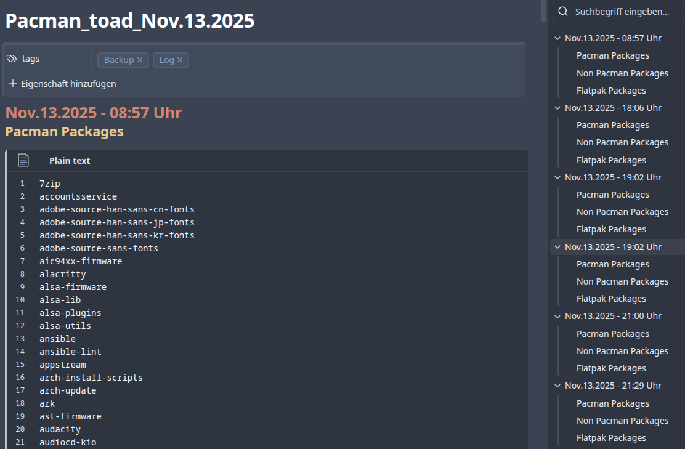

# archlinux-pacman
get more out of pacman

pacman hook pakets

The script pacman_hook_pakets.sh writes a log file in Markdown format.
The script is executed during install/upgrade/remove actions via a pacman hook.
The currently installed packages and flatpaks are logged.

pacman auto update

If you want your Arch Linux (or Manjaro etc.) to automaticly install new updates, you can use these files.

* Copy `auto-pacman-update.sh` to `/usr/local/bin/`
* Copy `auto-pacman-update.service` & `auto-pacman-update.timer` to `/etc/systemd/system/`

